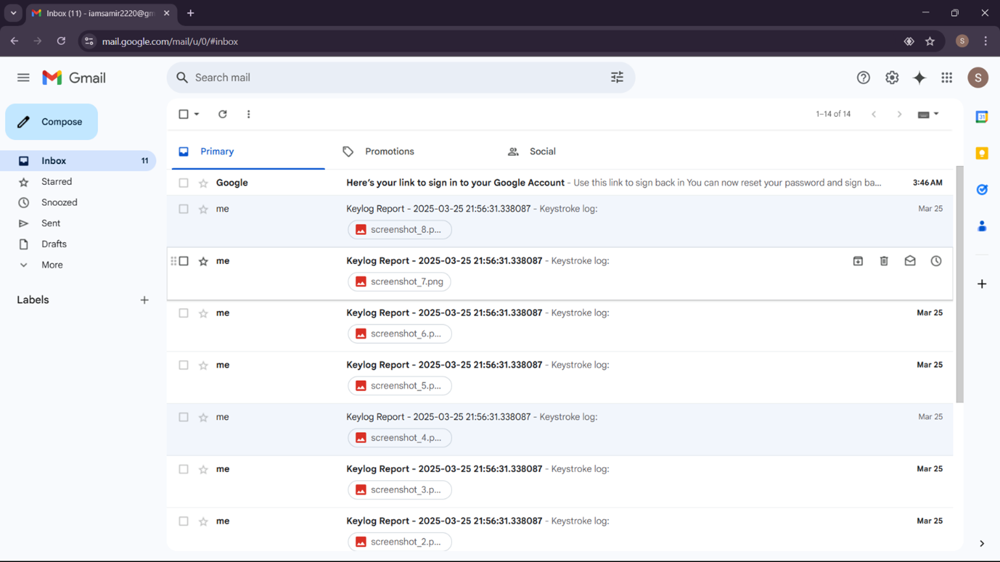
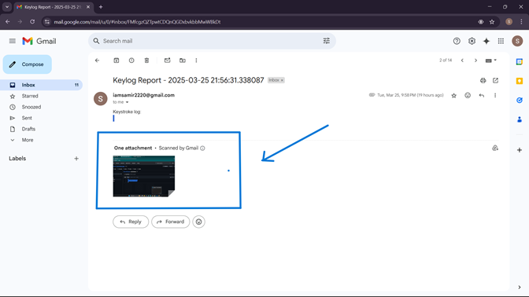

# Keylogger
A Python script for educational purposes demonstrating keylogging and screenshot capture techniques with email reporting.

# Python Keylogger & Screenshot Taker

****

A Python script that demonstrates how to capture keyboard inputs and take periodic screenshots, sending the collected data to a specified email address.

---

## ⚠️ **IMPORTANT: ETHICAL WARNING** ⚠️

This software is intended for **EDUCATIONAL AND ETHICAL PURPOSES ONLY**.

* **DO NOT** use this script on any computer you do not own or have explicit permission to monitor.
* Installing this software on another person's device without their knowledge or consent is illegal in many jurisdictions and a severe violation of privacy.
* The author is not responsible for any misuse or damage caused by this script. **You are solely responsible for your actions.**

---

## 📋 Features

* **Keystroke Logging:** Captures all key presses, including special keys (e.g., [SHIFT], [CTRL], [ENTER]).
* **Screenshot Capture:** Periodically captures the entire screen using `Pillow`.
* **Email Reporting:** Bundles the text log and screenshot image into an email and sends it via Gmail (SMTP) at a set interval.
* **Threading:** Uses `threading.Timer` to run the email and screenshot tasks concurrently without blocking the key listener.

## 🛠️ Setup and Configuration

### 1. Prerequisites

* Python 3.x
* `pip` (Python package installer)

### 🖼️ Screenshots

<p align="center">
  <br>
  <b>Figure 1:</b> Main GUI of Python Nmap Scanner
</p>

<p align="center">
  <br>
  <b>Figure 2:</b> Example of scan results display
</p>

### 2. Installation

1.  **Clone the repository:**
    ```bash
    git clone https://github.com/sam-rat/Keylogger
    cd Keylogger
    ```

2.  **Install the required libraries:**
    ```bash
    pip install -r requirements.txt
    ```

### 3. Configuration

Before running the script, you **must** update the configuration variables at the top of `KEYlogger.py`:

```python
# Configuration
EMAIL_ADDRESS = "your-email@gmail.com"  # The email you want to send reports from
EMAIL_PASSWORD = "your-app-password"    # The app-specific password for that email
SEND_INTERVAL = 60 # Seconds between email reports
SCREENSHOT_INTERVAL = 30 # Seconds between screenshots
MAX_SCREENSHOTS = 100 # (Optional: Limit screenshots)
